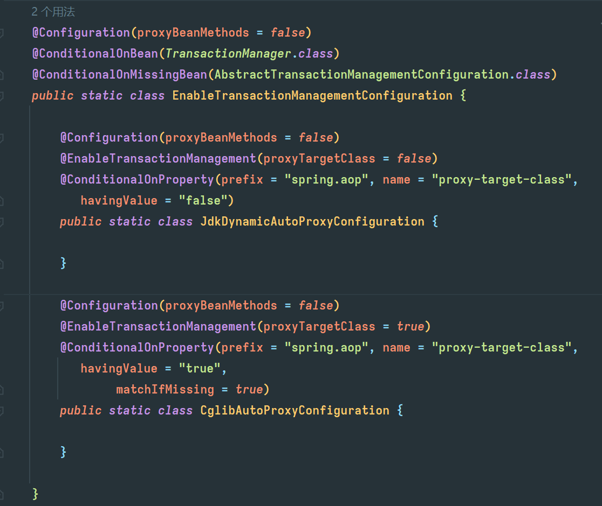

Required:使用当前事务,如果没有事务,则自己新建一个事务,子方式是必须运行在一个事务中的;

Supports:如果当前有事务,则使用事务,如果没有事务,则不使用事务

Mandatory:该传播属性强制必须存在一个事务,如果不存在,则抛出异常

Request_new:如果当前有事务,则挂起该事务,并且自己创建一个新的事务给自己使用,如果当前没有事务,则同Required

Not_supported:如果当前有事务,则挂起该事务,并且不使用事务;

Never:如果当前有事务,则抛出异常;如果当前没有事务,则不使用事务

Nested:如果当前有事务,则开启子事务(嵌套事务),嵌套事务是独立提交或者回滚,如果当前没有事务,则同required.
但是如果子事务提交,则会携带子事务一起提交
如果主事务回滚,则子事务会一起回滚,相反,子事务异常,则父事务可以回滚或不回滚

